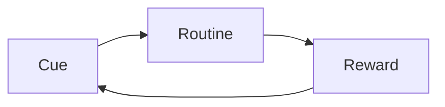

# Healthy Habits

> [!quote] Aristotle
> "We are what we repeatedly do. Excellence, then, is not an act, but a habit."

## The Science of Habit Formation

> [!info] The Habit Loop
> According to Charles Duhigg, every habit consists of three components:



Understanding this loop helps us build good habits and break bad ones. See [[Book Notes - Thinking Fast and Slow]] for the psychology behind decision-making.

## Daily Routine

> [!todo] My Daily Checklist
> - [x] Wake up at 6:30 AM
> - [x] Morning exercise (30 min)
> - [x] Meditation (10 min)
> - [x] Read for 30 minutes
> - [ ] Journal before bed
> - [ ] No screens after 10 PM

## Exercise

> [!tip] Start Small
> The key is consistency over intensity. Even 10 minutes of movement is better than nothing.

### Weekly Schedule

| Day | Activity | Duration | Intensity |
|-----|----------|----------|-----------|
| Monday | Running | 30 min | Medium |
| Tuesday | Strength training | 45 min | High |
| Wednesday | Yoga | 30 min | Low |
| Thursday | Swimming | 30 min | Medium |
| Friday | HIIT | 20 min | High |
| Saturday | Hiking | 60 min | Medium |
| Sunday | Rest | — | — |

> [!warning] Health Note
> Always warm up before intense exercise. Listen to your body and rest when needed.

## Nutrition

> [!note] My Diet Principles
> 1. Eat whole foods
> 2. Minimize processed sugar
> 3. Stay hydrated (2L water daily)
> 4. Meal prep on Sundays

### Water Intake Tracker

```
Morning:    ✓✓✓✓ (1L)
Afternoon:  ✓✓✓ (0.75L)
Evening:    ✓✓✓✓ (1L)
Total:      2.75L
```

## Sleep Hygiene

> [!abstract] Sleep is foundational
> Poor sleep affects everything from [[Machine Learning Intro|cognitive performance]] to emotional regulation.

**My sleep checklist:**
1. Bedroom temperature: 18-20°C
2. No caffeine after 2 PM
3. Read physical books before bed
4. Consistent bedtime: 10:30 PM

## Mental Health

> [!important] Self-care is not selfish
> Taking care of your mental health is essential for long-term productivity and happiness.

### Mindfulness Practice

```python
# Simple breathing exercise timer
import time

def breathing_exercise(cycles=5):
    for i in range(cycles):
        print(f"Cycle {i+1}:")
        print("  Breathe in... (4s)")
        time.sleep(4)
        print("  Hold... (7s)")
        time.sleep(7)
        print("  Breathe out... (8s)")
        time.sleep(8)
```

## Tracking Progress

> [!tip] Use Data
> Track your habits to see patterns. I use a simple spreadsheet to log daily habits.

| Week | Exercise | Sleep | Water | Reading |
|------|----------|-------|-------|---------|
| Week 1 | 5/7 | 6/7 | 4/7 | 7/7 |
| Week 2 | 6/7 | 5/7 | 6/7 | 7/7 |
| Week 3 | 4/7 | 7/7 | 5/7 | 6/7 |
| Week 4 | 6/7 | 6/7 | 7/7 | 7/7 |

> [!note] Related Notes
> - [[Book Notes - Thinking Fast and Slow]] — Understanding decision-making psychology
> - [[My PKM System]] — Organizing personal development knowledge
> - [[Travel Journal]] — Maintaining habits while traveling

---

*Tags: #health #habits #productivity #self-improvement*
