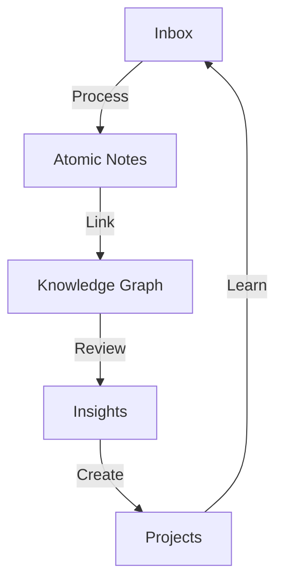

# How I Take Notes

> [!quote] Tiago Forte
> "The best thinking is done with a network of notes, not a single notebook."

## My Note-Taking Philosophy

> [!abstract] Core Principles
> 1. **Capture first, organize later** — Don't let perfect be the enemy of good
> 2. **Use bidirectional links** — Connect ideas across domains
> 3. **Write for your future self** — Assume you'll forget context
> 4. **Review regularly** — Knowledge without review decays

## The Zettelkasten Method

> [!info] Zettelkasten
> German for "slip box," this method was used by sociologist Niklas Luhmann to produce over 70 books and 400 articles.

### Key Concepts

1. **Atomic notes** — One idea per note
2. **Linking** — Connect related notes
3. **Emergent structure** — Let organization arise naturally
4. **Writing as thinking** — Clarify thoughts through writing



## My Workflow

> [!note] Daily Process
> 1. **Capture** — Quick notes throughout the day
> 2. **Process** — End of day, refine and link
> 3. **Review** — Weekly review of recent notes
> 4. **Create** — Turn notes into projects

## Bidirectional Links

> [!tip] The Power of Links
> Bidirectional links are the core of [[My PKM System|my knowledge management]]. They create:

1. **Context** — Links provide surrounding information
2. **Discovery** — Find unexpected connections
3. **Navigation** — Easy movement between related ideas
4. **Serendipity** — Random discoveries through graph traversal

### Linking Strategies

```markdown
# Example Links
- [[Web Development Basics]] — Topic reference
- [[Book Notes - Thinking Fast and Slow|Thinking Fast and Slow]] — Alias link
- [[Healthy Habits#Sleep Hygiene]] — Section link
- [[Machine Learning Intro]] — Cross-domain connection
```

## Common Mistakes

> [!danger] Pitfalls to Avoid
> 1. **Over-organizing** — Let structure emerge
> 2. **Perfect notes** — Done is better than perfect
> 3. **No links** — Isolated notes are useless
> 4. **No review** — Knowledge decays without use
> 5. **Copying instead of processing** — Engage with the material

> [!note] Related Notes
> - [[My PKM System]] — The complete system
> - [[Book Notes - Thinking Fast and Slow]] — Example literature note
> - [[Healthy Habits]] — Applying note-taking to habits
> - [[Quartz Blog Setup]] — Publishing workflow

---

*Tags: #notes #productivity #obsidian #pkm*
