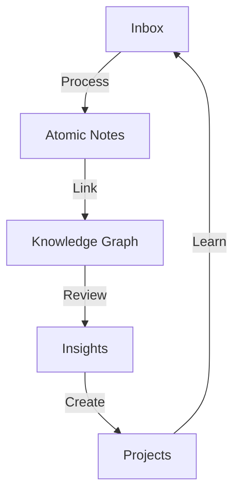

# How I Take Notes

> [!quote] Tiago Forte
> "The best thinking is done with a network of notes, not a single notebook."

## My Note-Taking Philosophy

> [!abstract] Core Principles
> 1. **Capture first, organize later** — Don't let perfect be the enemy of good
> 2. **Use bidirectional links** — Connect ideas across domains
> 3. **Write for your future self** — Assume you'll forget context
> 4. **Review regularly** — Knowledge without review decays

## The Zettelkasten Method

> [!info] Zettelkasten
> German for "slip box," this method was used by sociologist Niklas Luhmann to produce over 70 books and 400 articles.

### Key Concepts

1. **Atomic notes** — One idea per note
2. **Linking** — Connect related notes
3. **Emergent structure** — Let organization arise naturally
4. **Writing as thinking** — Clarify thoughts through writing



## My Workflow

> [!note] Daily Process
> 1. **Capture** — Quick notes throughout the day
> 2. **Process** — End of day, refine and link
> 3. **Review** — Weekly review of recent notes
> 4. **Create** — Turn notes into projects

### Step 1: Capture

> [!tip] Quick Capture
> Use the fastest method available:
> - Mobile: Obsidian app
> - Desktop: Quick add plugin
> - Browser: Web clipper
> - Voice: Transcription app

### Step 2: Process

> [!note] Processing Checklist
> - [ ] Is this note atomic (one idea)?
> - [ ] Does it have a clear title?
> - [ ] Are there links to related notes?
> - [ ] Is the context clear without external info?

### Step 3: Review

> [!warning] Don't Skip Reviews
> Reviewing is where the magic happens. I use a simple system:

| Frequency | Action | Time |
|-----------|--------|------|
| Daily | Process inbox | 15 min |
| Weekly | Review recent notes | 30 min |
| Monthly | Review all new notes | 1 hour |
| Quarterly | Major review & cleanup | 2 hours |

## Note Types

> [!info] Note Categories
> 1. **Fleeting notes** — Quick captures, temporary
> 2. **Literature notes** — Summaries of what you read
> 3. **Permanent notes** — Your own ideas and insights
> 4. **Project notes** — Specific to ongoing projects

### Example: Literature Note

> [!example] Book Note Template
> ```markdown
> # [Book Title]
> ## Key Ideas
> - Idea 1
> - Idea 2
> ## My Thoughts
> - How does this connect to [[Other Note]]?
> - What can I apply?
> ## Quotes
> > "Important quote here"
> ```

## Bidirectional Links

> [!tip] The Power of Links
> Bidirectional links are the core of [[My PKM System|my knowledge management]]. They create:

1. **Context** — Links provide surrounding information
2. **Discovery** — Find unexpected connections
3. **Navigation** — Easy movement between related ideas
4. ** serendipity** — Random discoveries through graph traversal

### Linking Strategies

> [!note] When to Link
> - When you mention a concept defined elsewhere
> - When two ideas relate but aren't obvious
> - When you want to create a "see also" reference
> - When building a knowledge graph

```markdown
# Example Links
- [[Web Development Basics]] — Topic reference
- [[Book Notes - Thinking Fast and Slow|Thinking Fast and Slow]] — Alias link
- [[Healthy Habits#Sleep Hygiene]] — Section link
- [[Machine Learning Intro]] — Cross-domain connection
```

## Tools I Use

> [!info] My Toolkit
> - **Obsidian** — Primary note-taking app
> - **Quartz** — Publishing [[Quartz Blog Setup|notes to the web]]
> - **Git** — Version control [[Git Version Control|for notes]]
> - **Docker** — [[Docker Containerization|Containerized workflow]]

## Common Mistakes

> [!danger] Pitfalls to Avoid
> 1. **Over-organizing** — Let structure emerge
> 2. **Perfect notes** — Done is better than perfect
> 3. **No links** — Isolated notes are useless
> 4. **No review** — Knowledge decays without use
> 5. **Copying instead of processing** — Engage with the material

## Measuring Success

> [!tip] Metrics That Matter
> - Number of new connections per week
> - Notes referenced in projects
> - Insights generated per month
> - Time to find relevant information

> [!note] Related Notes
> - [[My PKM System]] — The complete system
> - [[Book Notes - Thinking Fast and Slow]] — Example literature note
> - [[Healthy Habits]] — Applying note-taking to habits
> - [[Quartz Blog Setup]] — Publishing workflow

---

*Tags: #notes #productivity #obsidian #pkm*
