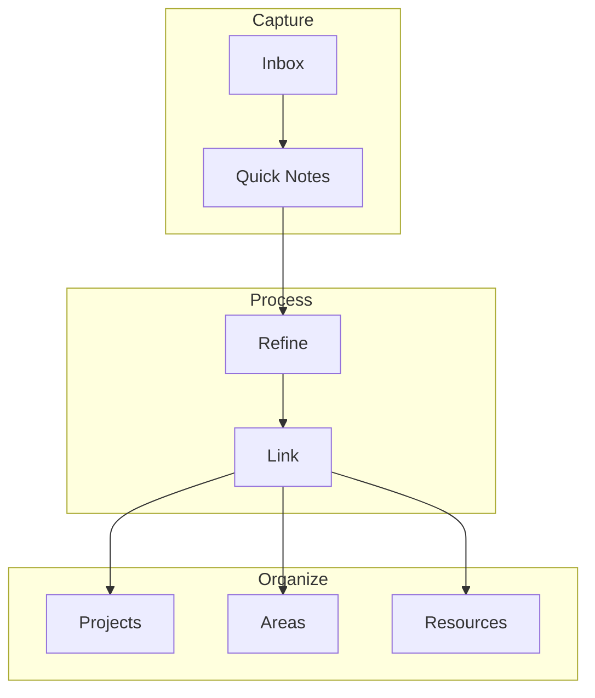

# My PKM System

> [!abstract] Personal Knowledge Management
> This note describes my complete system for capturing, organizing, and retrieving knowledge. It builds on the principles from [[How I Take Notes]].

## System Overview



> [!info] PARA Method
> I use Tiago Forte's PARA method:
> - **P**rojects — Short-term efforts with deadlines
> - **A**reas — Long-term responsibilities
> - **R**esources — Topics of ongoing interest
> - **A**rchive — Inactive items from above

## Tags System

> [!tip] Tagging Strategy
> Use tags for status and categories, not for linking.

### Status Tags
| Tag | Meaning |
|-----|---------|
| `#status/seed` | New, unprocessed |
| `#status/budding` | Partially developed |
| `#status/evergreen` | Fully refined |
| `#status/archived` | No longer maintained |

## Linking Strategy

> [!important] Links > Tags
> Tags are useful, but links create real knowledge connections.

### Link Types

```markdown
# 1. Direct reference
See [[Web Development Basics]] for more.

# 2. With alias
The [[Book Notes - Thinking Fast and Slow|Kahneman book]] changed my perspective.

# 3. Section link
Check [[Healthy Habits#Sleep Hygiene]] for sleep tips.
```

## Review Process

> [!todo] Weekly Review
> - [ ] Process inbox (15 min)
> - [ ] Review new connections (10 min)
> - [ ] Update project notes (20 min)
> - [ ] Clean up tags (5 min)

## Metrics

> [!info] System Health
> I track these metrics monthly:

| Metric | Target | Current |
|--------|--------|---------|
| Notes created | 20/month | 25 |
| Notes linked | >80% | 85% |
| Evergreen notes | 10/month | 12 |
| Graph density | >2.0 | 2.3 |

> [!note] See Also
> - [[How I Take Notes]] — Note-taking techniques
> - [[Book Notes - Thinking Fast and Slow]] — Example of a literature note
> - [[Healthy Habits]] — Applying PKM to personal development

---

*Tags: #pkm #knowledge-management #obsidian #productivity*
