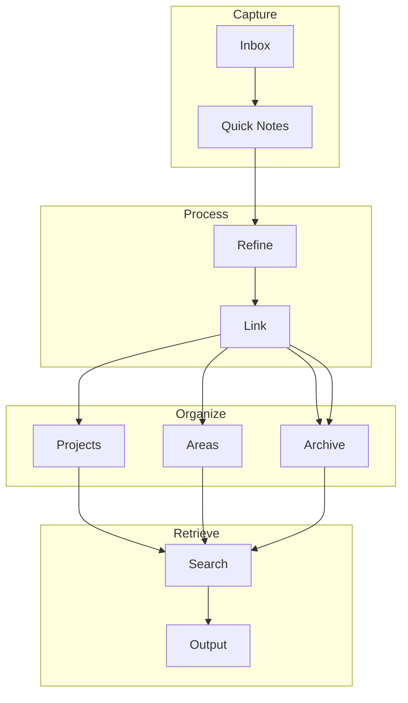

# My PKM System

> [!abstract] Personal Knowledge Management
> This note describes my complete system for capturing, organizing, and retrieving knowledge. It builds on the principles from [[How I Take Notes]].

## System Overview



> [!info] PARA Method
> I use Tiago Forte's PARA method:
> - **P**rojects — Short-term efforts with deadlines
> - **A**reas — Long-term responsibilities
> - **R**esources — Topics of ongoing interest
> - **A**rchive — Inactive items from above

## Folder Structure

> [!note] My Organization
> ```
> 📁 Vault
> ├── 📁 Inbox (unprocessed captures)
> ├── 📁 Projects
> │   ├── 📁 Quartz Blog Setup
> │   ├── 📁 Smart Home Automation
> │   └── 📁 Photography Portfolio
> ├── 📁 Areas
> │   ├── 📁 Health & Fitness
> │   ├── 📁 Finance
> │   └── 📁 Career
> ├── 📁 Resources
> │   ├── 📁 Web Development
> │   ├── 📁 Machine Learning
> │   └── 📁 Psychology
> └── 📁 Archive
> ```

## Tags System

> [!tip] Tagging Strategy
> Use tags for status and categories, not for linking.

### Status Tags
| Tag | Meaning |
|-----|---------|
| `#status/seed` | New, unprocessed |
| `#status/budding` | Partially developed |
| `#status/evergreen` | Fully refined |
| `#status/archived` | No longer maintained |

### Content Tags
| Tag | Use For |
|-----|---------|
| `#type/concept` | Definitions and explanations |
| `#type/process` | How-to guides |
| `#type/reference` | Factual information |
| `#type/insight` | Personal observations |

> [!note] Example
> This note is tagged: `#type/reference #status/evergreen`

## Linking Strategy

> [!important] Links > Tags
> Tags are useful, but links create real knowledge connections.

### Link Types

```markdown
# 1. Direct reference
See [[Web Development Basics]] for more.

# 2. With alias
The [[Book Notes - Thinking Fast and Slow|Kahneman book]] changed my perspective.

# 3. Section link
Check [[Healthy Habits#Sleep Hygiene]] for sleep tips.

# 4. Block reference (advanced)
> [!quote] "Important quote" ^quote1
> Referencing [[Note#^quote1]] here.
```

## Search Strategies

> [!tip] Finding Things
> 1. **Omnisearch** — Full-text search across all notes
> 2. **Graph view** — Visual exploration of connections
> 3. **Backlinks** — See what references a note
> 4. **Tags** — Filter by category or status
> 5. **Folders** — Browse by area or project

## Integration with Tools

> [!note] My Tech Stack
> - [[Quartz Blog Setup]] — Publishing to web
> - [[Git Version Control]] — Version control
> - [[Docker Containerization]] — Consistent environment
> - [[Web Development Basics]] — Building tools

### Automation

```yaml
# Example: Auto-tag new notes
triggers:
  - path: "inbox/"
    action: add_tag
    tag: "status/seed"
    
# Example: Link suggestions
features:
  - link_suggestions:
      enabled: true
      min_connections: 2
```

## Review Process

> [!todo] Weekly Review
> - [ ] Process inbox (15 min)
> - [ ] Review new connections (10 min)
> - [ ] Update project notes (20 min)
> - [ ] Clean up tags (5 min)

> [!todo] Monthly Review
> - [ ] Review all "seed" notes
> - [ ] Promote developed notes to "evergreen"
> - [ ] Archive completed projects
> - [ ] Update [[How I Take Notes|note-taking process]]

## Metrics

> [!info] System Health
> I track these metrics monthly:

| Metric | Target | Current |
|--------|--------|---------|
| Notes created | 20/month | 25 |
| Notes linked | >80% | 85% |
| Evergreen notes | 10/month | 12 |
| Graph density | >2.0 | 2.3 |
| Search success | >90% | 92% |

> [!warning] Warning Signs
> - Many unlinked notes
> - Lots of "seed" status notes
> - Low graph connectivity
> - Can't find notes you know exist

## Lessons Learned

> [!tip] Key Insights
> 1. **Start simple** — Complexity emerges naturally
> 2. **Link aggressively** — More links = more value
> 3. **Review regularly** — Maintenance is essential
> 4. **Output matters** — Use notes to create things
> 5. **Be patient** — PKM compounds over time

> [!danger] Common Failures
> 1. Over-engineering the system
> 2. Spending more time organizing than using
> 3. Not linking notes
> 4. Abandoning the system after a few weeks

## Related Systems

> [!note] Inspiration
> - Zettelkasten method — [[How I Take Notes#The Zettelkasten Method]]
> - PARA method — Tiago Forte's organizational framework
> - Building a Second Brain — Comprehensive PKM course
> - Evergreen notes — Andy Matuschak's concept

> [!note] See Also
> - [[How I Take Notes]] — Note-taking techniques
> - [[Book Notes - Thinking Fast and Slow]] — Example of a literature note
> - [[Healthy Habits]] — Applying PKM to personal development
> - [[Machine Learning Intro]] — Using PKM for learning

---

*Tags: #pkm #knowledge-management #obsidian #productivity*
