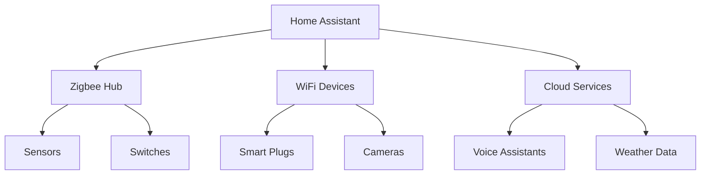

# Smart Home Automation

> [!abstract] Project Goal
> Build a self-hosted smart home system using Home Assistant, running on a Raspberry Pi with [[Docker Containerization|Docker]] containers.

## Architecture



> [!info] Why Home Assistant?
> Unlike commercial solutions, Home Assistant:
> - Runs locally (no cloud dependency)
> - Supports 2000+ integrations
> - Is fully customizable
> - Respects your privacy

## Hardware Setup

| Component | Model | Purpose | Cost |
|-----------|-------|---------|------|
| Hub | Raspberry Pi 4 (4GB) | Main controller | $55 |
| Zigbee | ConBee II | Zigbee coordinator | $35 |
| Sensors | Aqara Temperature | Environment monitoring | $15 each |
| Switches | Sonoff Basic | Light control | $10 each |
| Plugs | Xiaomi Smart Plug | Energy monitoring | $20 each |

> [!tip] Budget Tip
> Start small and expand. You don't need everything at once.

## Docker Compose

```yaml
version: '3'
services:
  homeassistant:
    container_name: homeassistant
    image: homeassistant/home-assistant:stable
    volumes:
      - /PATH_TO_CONFIG:/config
      - /etc/localtime:/etc/localtime:ro
    restart: unless-stopped
    network_mode: host
    devices:
      - /dev/ttyUSB0:/dev/ttyUSB0

  mosquitto:
    container_name: mosquitto
    image: eclipse-mosquitto:2
    ports:
      - "1883:1883"
    volumes:
      - ./mosquitto/config:/mosquitto/config
      - ./mosquitto/data:/mosquitto/data
      - ./mosquitto/log:/mosquitto/log
    restart: unless-stopped

  zigbee2mqtt:
    container_name: zigbee2mqtt
    image: koenkk/zigbee2mqtt
    volumes:
      - ./zigbee2mqtt/data:/app/data
      - /run/udev:/run/udev:ro
    devices:
      - /dev/ttyUSB0:/dev/ttyUSB0
    restart: unless-stopped
    environment:
      - TZ=Asia/Shanghai
```

See [[Docker Containerization]] for more Docker concepts.

## Automations

> [!note] Example Automations
> Here are some useful automations I've set up:

### Morning Routine

```yaml
automation:
  - alias: "Morning Routine"
    trigger:
      - platform: time
        at: "06:30:00"
    action:
      - service: light.turn_on
        target:
          entity_id: light.bedroom
        data:
          brightness_pct: 50
          color_temp_kelvin: 2700
      - service: media_player.play_media
        target:
          entity_id: media_player.bedroom_speaker
        data:
          media_content_id: "morning_playlist"
          media_content_type: "music"
```

### Energy Saving

```yaml
automation:
  - alias: "Turn Off Unused Devices"
    trigger:
      - platform: state
        entity_id: group.family
        to: "not_home"
        for: "00:15:00"
    action:
      - service: homeassistant.turn_off
        target:
          entity_id: group.all_lights
      - service: climate.set_temperature
        target:
          entity_id: climate.living_room
        data:
          temperature: 18
```

> [!warning] Security
> Never expose your Home Assistant instance directly to the internet. Use a VPN or [[Quartz Blog Setup|Cloudflare Tunnel]] for remote access.

## Dashboard

> [!tip] Lovelace UI
> Customize your dashboard for quick access to important controls.

```yaml
views:
  - title: Home
    cards:
      - type: thermostat
        entity: climate.living_room
      - type: light
        entities:
          - light.bedroom
          - light.living_room
          - light.kitchen
      - type: sensor
        entity: sensor.temperature
        graph: line
```

## Lessons Learned

> [!note] What Works
> 1. Start with lighting — immediate quality of life improvement
> 2. Use Zigbee over WiFi — more reliable, lower power
> 3. Automate routines, not individual devices
> 4. Keep automations simple — complex ones break

> [!danger] What Doesn't Work
> 1. Trying to automate everything at once
> 2. Relying on cloud-only devices
> 3. Complex conditional automations
> 4. Ignoring backup procedures

## Future Plans

> [!todo] Expansion Roadmap
> - [x] Lighting control
> - [x] Temperature monitoring
> - [x] Energy monitoring
> - [ ] Security cameras
> - [ ] Voice control integration
> - [ ] Automated blinds
> - [ ] Garden irrigation

> [!note] See Also
> - [[Docker Containerization]] — Container setup
> - [[Machine Learning Intro]] — Potential ML integrations
> - [[Healthy Habits]] — Sleep automation
> - [[Git Version Control]] — Config versioning

---

*Tags: #smart-home #iot #home-assistant #automation*
