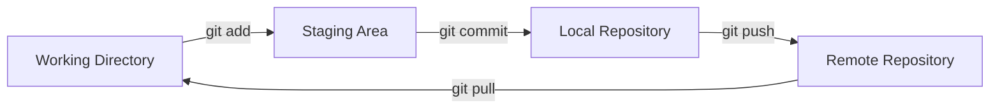

# Git Version Control

> [!abstract] What is Git?
> Git is a distributed version control system designed to track changes in source code during software development. It's essential for projects like [[Quartz Blog Setup]] and [[Web Development Basics]].

## Essential Commands

```bash
# Initialize a repository
git init

# Stage and commit
git add .
git commit -m "feat: add new feature"

# Branch management
git checkout -b feature/new-thing
git merge feature/new-thing

# Remote operations
git remote add origin <url>
git push -u origin main
git pull origin main
```

## Git Workflow



## Commit Message Convention

> [!tip] Conventional Commits
> Use a consistent format for commit messages:

| Prefix | Purpose | Example |
|--------|---------|---------|
| `feat:` | New feature | `feat: add user auth` |
| `fix:` | Bug fix | `fix: resolve login error` |
| `docs:` | Documentation | `docs: update README` |
| `refactor:` | Code restructuring | `refactor: extract utils` |
| `test:` | Adding tests | `test: add unit tests` |
| `chore:` | Maintenance | `chore: update deps` |

## Branching Strategies

> [!note] Git Flow vs GitHub Flow
> Choose based on your team size and release cycle.

**Git Flow** (for projects with scheduled releases):
- `main` — production code
- `develop` — integration branch
- `feature/*` — new features
- `release/*` — release preparation
- `hotfix/*` — urgent fixes

**GitHub Flow** (for continuous deployment):
- `main` — always deployable
- `feature/*` — all changes in branches

## Useful Aliases

```bash
# Add to ~/.gitconfig
[alias]
    st = status
    co = checkout
    br = branch
    cm = commit -m
    lg = log --oneline --graph --all
    last = log -1 HEAD
    unstage = reset HEAD --
```

> [!warning] Common Mistakes
> 1. Committing too early — stage related changes together
> 2. Poor commit messages — be descriptive, see [[How I Take Notes]] for communication tips
> 3. Force pushing to shared branches — always use `--force-with-lease`

## .gitignore

```gitignore
# Dependencies
node_modules/
venv/

# Build output
dist/
build/

# IDE
.vscode/
.idea/

# OS files
.DS_Store
Thumbs.db

# Secrets
.env
*.pem
```

> [!danger] Never Commit Secrets
> If you accidentally commit credentials, rotate them immediately. Use environment variables and tools like [[Docker Containerization|Docker secrets]] for sensitive data.

## Collaboration Tips

> [!todo] Best Practices
> - [x] Pull before pushing
> - [x] Write meaningful commit messages
> - [x] Review diffs before committing
> - [ ] Use interactive rebase to clean up history
> - [ ] Set up pre-commit hooks

> [!note] See Also
> - [[Web Development Basics]] — Using Git in web projects
> - [[Machine Learning Intro]] — Version controlling ML experiments
> - [[My PKM System]] — How I track knowledge changes

---

*Tags: #git #version-control #collaboration #cli*
