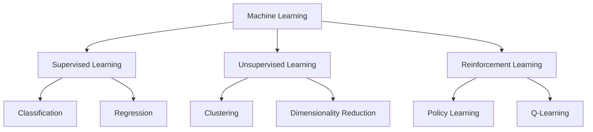

# Machine Learning Introduction

> [!quote] Arthur Samuel (1959)
> "Machine Learning is the field of study that gives computers the ability to learn without being explicitly programmed."

## What is Machine Learning?

Machine Learning is a subset of [[Web Development Basics|artificial intelligence]] that enables systems to learn and improve from experience. Instead of explicit programming, ML algorithms build mathematical models based on training data.

## Types of Machine Learning



### Supervised Learning

In supervised learning, we have labeled data:

$$y = f(x) + \epsilon$$

Where:
- $y$ is the target variable
- $x$ represents features
- $\epsilon$ is noise

> [!math] Linear Regression
> The simplest model: $\hat{y} = \beta_0 + \beta_1 x_1 + \beta_2 x_2 + \ldots + \beta_n x_n$

```python
from sklearn.linear_model import LinearRegression
import numpy as np

# Sample data
X = np.array([[1], [2], [3], [4], [5]])
y = np.array([2, 4, 5, 4, 5])

# Train model
model = LinearRegression()
model.fit(X, y)

# Predict
print(f"Coefficient: {model.coef_[0]:.2f}")
print(f"Intercept: {model.intercept_:.2f}")
```

### Unsupervised Learning

No labels provided — the algorithm finds patterns:

```python
from sklearn.cluster import KMeans

kmeans = KMeans(n_clusters=3, random_state=42)
clusters = kmeans.fit_predict(data)
```

> [!info] K-Means Algorithm
> 1. Initialize $k$ centroids randomly
> 2. Assign each point to nearest centroid
> 3. Recalculate centroids as mean of assigned points
> 4. Repeat until convergence

## Neural Networks

> [!tip] Deep Learning
> Neural networks with multiple hidden layers are called "deep" neural networks. They form the basis of [[Smart Home Automation|modern AI applications]].

The forward pass of a neural network:

$$z^{[l]} = W^{[l]}a^{[l-1]} + b^{[l]}$$
$$a^{[l]} = g(z^{[l]})$$

Where $g$ is an activation function like ReLU:

$$g(z) = \max(0, z)$$

## Evaluation Metrics

| Metric | Use Case | Formula |
|--------|----------|---------|
| Accuracy | Classification | $\frac{TP + TN}{TP + TN + FP + FN}$ |
| Precision | When FP is costly | $\frac{TP}{TP + FP}$ |
| Recall | When FN is costly | $\frac{TP}{TP + FN}$ |
| F1 Score | Balanced measure | $2 \cdot \frac{Precision \cdot Recall}{Precision + Recall}$ |

> [!warning] Common Mistake
> Don't confuse correlation with causation! A model might find spurious patterns in training data that don't generalize. See [[Book Notes - Thinking Fast and Slow]] for cognitive biases that affect data interpretation.

## Learning Path

> [!todo] My ML Journey
> - [x] Python basics — see [[Web Development Basics]]
> - [x] Linear regression
> - [x] Classification algorithms
> - [ ] Deep learning with PyTorch
> - [ ] Natural Language Processing
> - [ ] Computer Vision

> [!note] Related Notes
> - [[How I Take Notes]] — Organizing ML study materials
> - [[Git Version Control]] — Version controlling ML experiments
> - [[Docker Containerization]] — Reproducible ML environments

---

*Tags: #machine-learning #ai #python #data-science*
